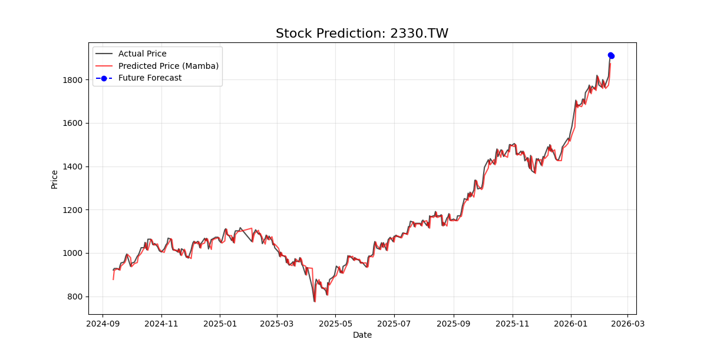
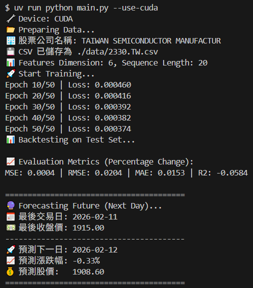

# MambaQuant: 基於 Mamba 架構的全球股市預測工具 (支援台股/美股)

[🇹🇼 繁體中文說明](README.zh-TW.md) | [🇺🇸 English](README.md)

[](https://www.python.org/)
[](LICENSE)
[](https://github.com/astral-sh/uv)
[](https://pytorch.org/)

**MambaQuant** 實作了一個基於 **Mamba (S6)** 架構（結構化狀態空間序列模型）的股價預測模型。Mamba 在序列建模任務中取得了顯著的成功，在保持 Transformer 效能的同時，提供了線性時間複雜度。  
本儲存庫利用歷史股票數據，使用 **滑動視窗 (Sliding Window)** 方法來預測未來的價格趨勢，並包含一個專門的推論步驟，用於預測下一個交易日的價格。

## **✨ 主要功能**

* **Mamba 架構**：比 Transformer 更有效地處理長序列時間序列數據，且記憶體使用量更低。  
* **自動獲取數據**：整合 yfinance 自動下載股票數據（支援全球股票代碼，例如：2330.TW, AAPL, NVDA）。  
* **滑動視窗**：使用歷史視窗（例如：過去 20 天）來預測下一個時間步，防止前瞻偏差 (look-ahead bias)。  
* **未來推論**：在訓練後自動預測下一個交易日 (T+1) 的股價。

## 📊 結果展示


## **🛠️ 需求**

我們使用 uv 進行高速的依賴管理和環境設置。

### **1\. 安裝**

首先，複製 (clone) 儲存庫：  
```
git clone https://github.com/LouieLK/MambaQuant.git
cd MambaQuant
```

### **2\. 設置環境**

同步依賴項（如果配置正確，這將自動建立虛擬環境並安裝支援 CUDA 的 PyTorch）：  
```
uv sync
```

## **🚀 使用方法**

您可以直接使用 uv run 執行訓練腳本。該腳本會自動處理數據下載、預處理、訓練和可視化。

### **使用 CUDA (推薦)**
```
uv run python main.py --use-cuda
```
### **僅使用 CPU**
```
uv run python main.py
```
### **自定義訓練範例**

針對台積電 (2330.TW) 進行訓練，滑動視窗為 60 天：  
```
uv run python main.py --ts-code 2330.TW --seq-len 60 --use-cuda
```
### **訓練結果**


## **⚙️ 選項**

可以使用命令行參數來自定義模型行為。以下是可用選項的完整列表：

| 參數 | 類型 | 預設值 | 說明 |
| :---- | :---- | :---- | :---- |
| \--use-cuda | Flag | False | 啟用 CUDA 訓練（需要 NVIDIA GPU）。 |
| \--ts-code | str | 2330.TW | 股票代碼符號（例如 2330.TW, AAPL）。 |
| \--seq-len | int | 20 | 滑動視窗的大小（回溯期）。 |
| \--epochs | int | 50 | 訓練的輪數 (epochs)。 |
| \--batch-size | int | 64 | 訓練的批次大小。 |
| \--lr | float | 0.001 | 學習率。 |
| \--hidden | int | 32 | Mamba 層中隱藏狀態的維度。 |
| \--layer | int | 2 | 堆疊的 Mamba 層數。 |
| \--n-test | int | 365 | 用於測試集（回測）的天數。 |
| \--wd | float | 1e-5 | 權重衰減 (L2 正則化)。 |
| \--seed | int | 1 | 用於可重現性的隨機種子。 |

## **👨‍💻 維護者與貢獻**

本專案 Fork 並改進自 [zshicode/MambaStock](https://github.com/zshicode/MambaStock)。本專案由 Louie Huang (GitHub: @LouieLK) 維護。

雖然核心 Mamba 模型架構沿用了原始設計，但本專案致力於將其轉化為生產級 (Production-Ready) 的應用工具，主要差異與貢獻如下：
* **全球市場支援**: 整合 `yfinance` 支援全球股票（美股、台股、加密貨幣）動態抓取，移除靜態 CSV 依賴。
* **生產級管線**: 重構為模組化結構 (`src/`, `data/`) 並遷移至 `uv` 進行確定性依賴管理。
* **進階推論邏輯**: 實作 **滑動視窗** 機制防止前瞻偏誤，並新增 **未來推論** 步驟預測 T+1 價格。
* **DevOps & 易用性**: 新增穩健的 CLI 參數解析、雙語文件，並簡化 CUDA/CPU 執行流程。

## **🔮 未來規劃 (Roadmap)**
我計劃在未來版本中加入以下功能，歡迎任何人貢獻：
* **圖形化介面 (GUI)**: 實作 Streamlit 或 Gradio 儀表板，提供互動式股價視覺化與參數調整。

## **📚 引用**

```
@article{shi2024mamba,  
  title={MambaStock: Selective state space model for stock prediction},  
  author={Zhuangwei Shi},  
  journal={arXiv preprint arXiv:2402.18959},  
  year={2024},  
}  
```